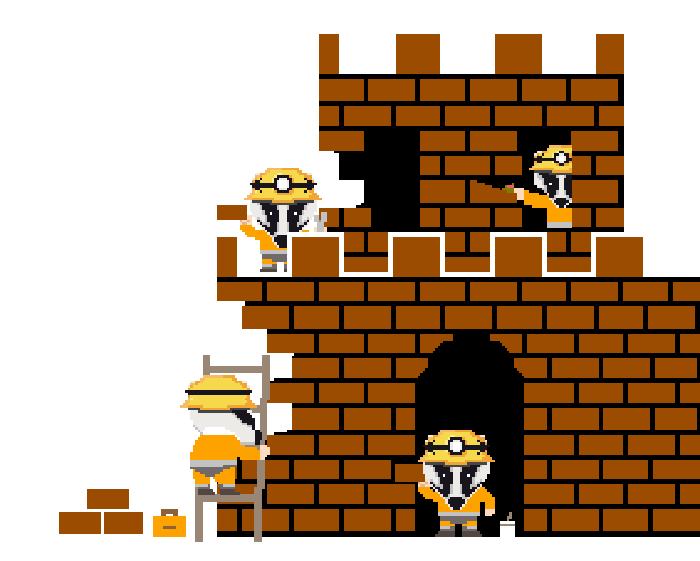

 
  

# Redwall

Inspired by the comradery of _The Long Patrol_, the **Redwall** is an open source approvals monitoring and alerting tool that aims to identify potential phishing attacks before they happen.

Redwall consists currently of three components:

- Subgraph
- UI Dashboard
- Monitoring Lambda

Approval events are captured by the subgraph to allow data to be queried via GraphQL.
The subgraph powers both the dashboard and the monitoring functionality.

## Documentation

Instructions for how to setup a development environment and deploy the components of Redwall are available in [Setup Instructions](./docs/setup.md).
